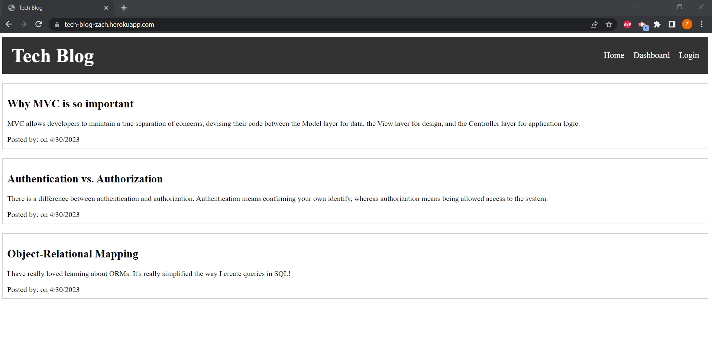

# Tech Blog

## Description

This application is built as a blog for tech related posts. It allows users to log in and make posts and view other posts.

## Technologies Used

This application was built using HTML, CSS, JavaScript, Handlebars, Express, Node, Sequalize, and SQL. 

## Application Links

Deployed Heroku Application: https://tech-blog-zach.herokuapp.com/

GitHub Repo: https://github.com/wobbledy/tech-blog

## Application Screenshots

